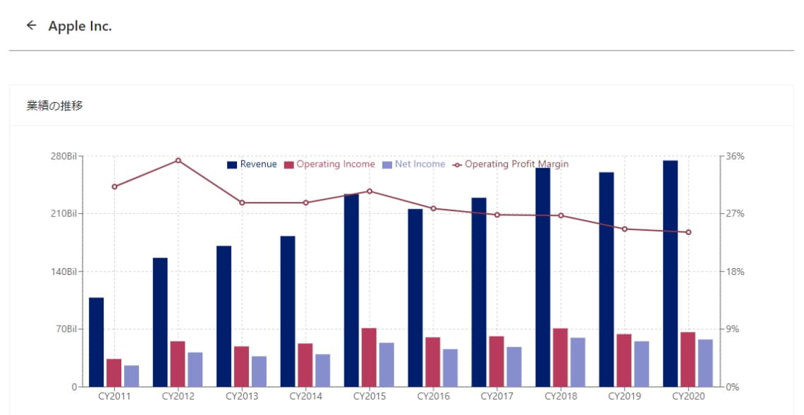

# Alpha Gazer

Visualize data of Form 10-K, 10-Q.

## 🗿 Introduction

[Alpha Gazer](https://edgar.damonge.com) is a graphical viewer of EDGAR's From 10-K, 10-Q data.

## 🎨 Features

- Chart based visualized data.

## 🛠 Project Structure

| directory                 | explain                                             |
| ------------------------- | --------------------------------------------------- |
| public/                   | 静的な公開ファイル                                  |
| src/components/           | UI コンポーネント、Atomic Design ベース             |
| src/components/atoms/     | 最小単位の UI、ボタンやテキストなど                 |
| src/components/molecules/ | atoms を組み合わせた部品、検索フォームなど          |
| src/components/organisms/ | molecules や atoms を組み合わせた部品、ヘッダーなど |
| src/components/template/  | organisms を組み合わせた部品                        |
| src/pages/                | ルーティングされるページ                            |
| src/styles/               | CSS, SCSS                                           |

## ❤ Special Thanks

### Background Picture

- [Guillaume Meurice](https://www.pexels.com/ja-jp/photo/1894350/)
